# Qversity Data Final Project 2025

## Overview

This project implements a complete end-to-end ELT data pipeline using the Medallion Architecture (Bronze, Silver, Gold). The main goal is to integrate the data engineering tools learned during the Qversity training, and extract business insights from a custom dataset.

The dataset used is a messy JSON file stored in a public S3 bucket, containing information about mobile service customers. This pipeline ingests the data, transforms it through successive layers, and ultimately provides business-ready tables that answer real-world analytical questions.

At the end of this readme file there are the **key business questions answered in the Gold Layer**, each linked to its corresponding dbt model

**Technologies used:**

- Docker
- PostgreSQL
- Apache Airflow
- dbt
- Python

---

## Author

- **Name**: Camilo Cordoba Bedoya
- **Email**: camilocb204@gmail.com  
- **City**: Medellín  
- **Cohort**: Qversity 2025  

---

## Quick Start


### 1. Clone the Repository

```bash
git clone https://github.com/ccordobab/qversity-data-2025-medellin-camilocordoba.git
cd qversity-data-2025-medellin-camilocordoba
```

### 2. Clone and setup environment:
```bash
# Copy environment template
cp env.example .env
```
### 3. Start Docker Containers

This project uses docker-compose to run:

- Airflow (orchestration)
- PostgreSQL (database)
- DBT (transformations)

Start all containers:

```bash
docker compose up --build -d
```
### Requirements

- Docker & Docker Compose
- Python 3.11+
- dbt-postgres

### Access Points

Airflow UI: http://localhost:8080 (admin/admin)

PostgreSQL: localhost:5432 (airflow/airflow)

### postgreSQL connection parameters

-Username: qversity-admin
-Password: qversity-admin
-Base de datos: qversity
-Servidor: localhost
-Puerto: 5432

### What to Expect in PostgreSQL After the Pipeline Runs

to see what schemas there are enter the following comands 

```bash
cd qversity-data-2025-medellin-camilocordoba
docker compose exec postgres psql -U qversity-admin -d qversity
\dn
```
after running those commmands, you will get the list of schemas.

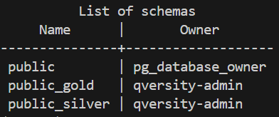
 
to access the bronze table you will need to enter to the public schema and find the bronze_mobile_customers table 
```bash
\dt public.*
```
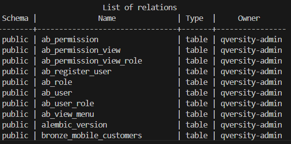


to access the public_silver schema enter the following command
```bash
\dt public_silver.*
```
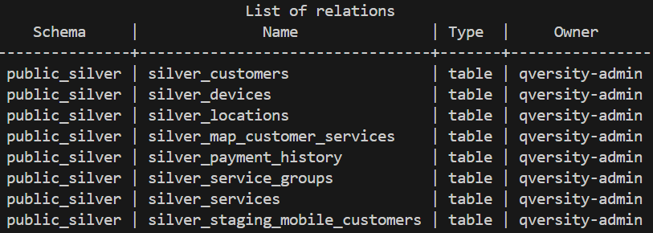

to access the public_gold schema enter the following command
```bash
\dt public_gold.*
```

and you  will get something like this. the image is of the actual public_gold schema but all the tables did not fit in the screeshot.


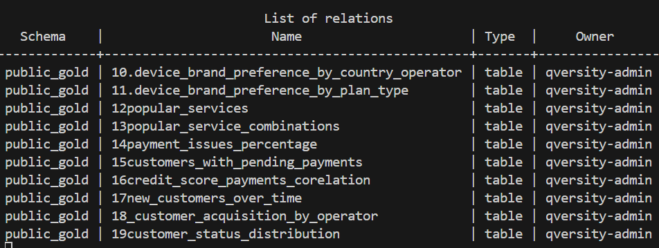
---
## Run pipeline
#### 1. Run Environment
```bash
docker compose up -d
```
#### 2. trigger dag

Open Airflow at localhost:8080, trigger the bronze_silver_gold DAG manually

---
## Run tests

```bash
cd qversity-data-2025-medellin-camilocordoba
docker compose exec dbt bash
dbt test
```
---


## Bronze Layer – Raw Ingestion

### Goal
Store the raw JSON data as-is from the public S3 bucket, preserving its original structure while adding basic metadata for traceability ("ingestion_timestamp").

### Tools Used
- **Apache Airflow** for orchestration
- **Python** for data handling
- **pandas** for DataFrame processing
- **SQLAlchemy** for database connectivity
- **PostgreSQL** as the storage layer

### Actions Taken

- A Python-based Airflow DAG was created to orchestrate the ingestion process.
- The DAG downloads the JSON file from the following public S3 endpoint:
https://qversity-raw-public-data.s3.amazonaws.com/mobile_customers_messy_dataset.json
- The raw data is parsed into a DataFrame using pandas and stored in PostgreSQL in the table: bronze_mobile_customers
- An additional column ingestion_timestamp is added to each record to capture the load time.
- The ingestion task uses to_sql to convert the DataFrame into a PosfgreSQL table.

Additionals
- To promote clean code and reuse, a dedicated module utils.py was created to hold helper functions for data extraction and serialization.

---

## Silver Layer – Detailed Data Cleaning and Standardization

#### Model: `silver_staging_mobile_customers.sql`

This model performs detailed cleaning and normalization of the raw mobile customer data ingested in the Bronze layer. The main purpose is to make the dataset ready for analytical use by removing inconsistencies, parsing formats, correcting typos, and enforcing data quality standards.


### Transformations and Rationales

Each transformation addresses a real-world data inconsistency or usability challenge. Below is a breakdown of each cleaning step, why it was necessary, and how it was implemented.


#### 1. Text Field Normalization
- **What:** Standardize text fields such as names, emails, cities, countries.
- **Why:** Input data often comes with inconsistent casing, unwanted spaces, and formatting variations for example " BOGOTA ", "bogota", "Bogota".
- **How:**
  - `trim()` removes trailing and leading whitespaces.
  - `lower()` converts strings to lowercase for consistency.
  - `initcap()` capitalizes the first letter of each name for readability.

#### 2. Age Validation and Correction
- **What:** Valid ages are retained and rounded. Out-of-bound values (<18 or >110) are discarded.
- **Why:** Ages outside human limits are likely errors. Business questions often need grouped age buckets.
- **How:** `cast(age as numeric)` → `round(...)` → `cast(... as integer)`
- **Why this method:** Combines validation with standardization in one step.

#### 3. Standarization and Correction of Country, City, Operator, Brand and Plan Type fields Using Fuzzy Matching
- **What:** Standarize field values fixing typos and grouping variations using fuzzy logic.
- **Why:** Free-text entries have typos like "mexcio", "chilw". and Operators like "claro", "Claro", " CLARO " must be unified.
- **How:** `difference(str1, str2)` with a score threshold (>= 3) or (>= 2) depending on what is needed
- **Why this method:** Allows tolerance to typos without requiring lookup tables or complex ML models.

#### 4. Enforce Numeric Data Types
- **What:** Convert fields like credit_score, monthly_bill_usd, age into proper numeric formats.
- **Why:** Downstream calculations require numeric types for sums, averages, etc.
- **How:** `cast(field as numeric)` or `cast(field as float)`
- **Why this method:** Ensures compatibility with SQL math operations.

#### 5. Parse Diverse Date Formats
- **What:** Normalize `registration_date` from multiple formats: `YYYY-MM-DD`, `DD-MM-YYYY`, `YYYYMMDD`, etc.
- **Why:** Mixed formats cause errors in filtering, joining or aggregation by date.
- **How:** using Regex (`~`) to determine what format is the date written in the bronze layer and using conditional logic with `to_date(...)` to casted to date format
- **Why this method:** Covers edge cases without requiring external libraries.

#### 6. Translate and Normalize Status & Brand Fields
- **What:** Unify `status` across languages or pre-determined variations.
- **Why:** Different languages ("activo", "active") or variations ("invalido", "inactivo") break grouping.
- **How:** `case when` the word is present in a set with possible values and translations .
- **Why this method:** Offers full control and explainability of rules applied.

#### 7. City-Based Country Correction (Fallback)
- **What:** If country is wrong or missing, infer it based on known city mappings.
- **Why:** Some cities are filled while countries are null or incorrect, sometimes the country does not match correctly the city in the bronze lay.
- **How:** `case when city in (...) then country`
- **Why this method:** Enhances data completeness using geographic clues.

#### 8. De-duplicate by Latest Record
- **What:** Keep only the most recent version of each customer_id record.
- **Why:** Duplicates introduce inconsistencies or double-counting.
- **How:** `select distinct on (customer_id)` + `order by ingestion_timestamp desc`

#### 9. Track Ingestion and Transformation Timestamps
- **What:** Track when the data was ingested and transformed.
- **Why:** Useful for debugging, lineage, and reproducibility.
- **How:** Use `current_timestamp` and keep original `ingestion_timestamp`

###  Final Outcome

This Silver model results in a high-quality dataset with:
- Clean and consistent formatting
- Parsed and validated formats (dates, numerics)
- Inferred values for missing or incorrect fields
- Removal of duplicates and noisy data
- Timestamps for traceability


## ENTITY RELATIONSHIP DIAGRAM

As part of the Silver layer, the goal is not only to clean the data (handled in `silver_staging_mobile_customers.sql`) but also to normalize the dataset into well-structured dimension and fact tables. This improves analytical performance, reduces redundancy, and prepares the data for complex joins and business logic in the Gold layer.

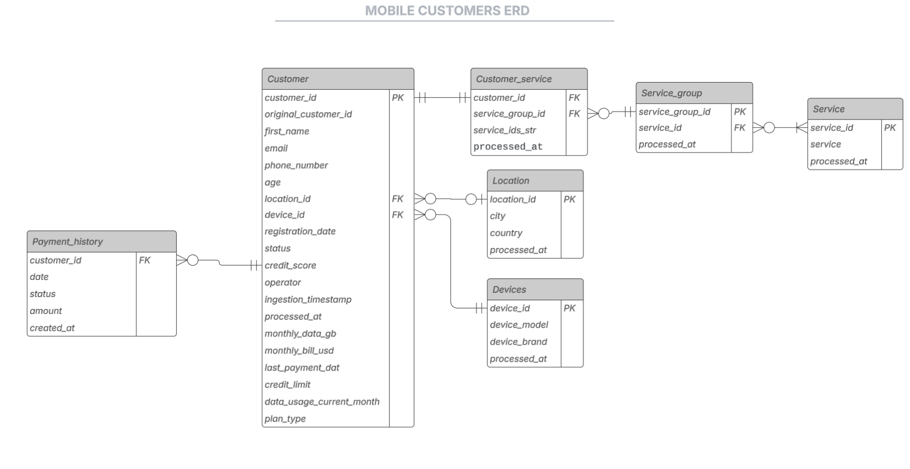

## here is what was done inside the silver layer tables

### `silver_device.sql`

#### Purpose:
Create a device dimension table with each unique combination of device_brand and device_model, assigning a key (device_id).

#### Why:
- Reduces redundancy by avoiding repetition of brand/model text across the dataset.
- Enables device-level aggregations or filters.

#### How:
- Extracts all distinct device brand + model pairs.
- Generates a unique device_id using row_number().


### `silver_locations.sql`

#### Purpose:
Create a location dimension table with each unique combination of city and country, assigning a key (location_id).

#### Why:
- Enables standard geographic analysis.
- Reduces storage overhead by replacing text with numerical IDs.
- Ensures city-country pairs are consistent across joins.

#### How:
- Extracts distinct city + country combinations.
- Applies row_number() to create a key.


### `silver_customers.sql`

#### Purpse:
Build a normalized customer fact table that contains all customer information related columns and references device_id and location_id instead of storing raw strings.

#### Why:
- Centralizes references to customer information columns including device and location.

#### How:
- Starts from the cleaned staging table.
- Joins with silver_locations on city and country.
- Joins with silver_devices on device_brandd and device_model.

### Contracted Services Normalization

The following dbt models transform and normalize the `contracted_services` field from raw text lists into properly structured dimensional tables. This enables robust analysis of service combinations, preferences, and segmentation.

#### `silver_services.sql`

**Purpose:** 
Create a clean list of unique individual services. so that we can treat each service as an entity, making it possible to count, group, and join on individual services.

**Why:**
In the raw Bronze layer, contracted_services was stored as a string like "{internet,voice}", with inconsistent ordering. This made analysis and joining operations impossible.

**How:**
1. **Remove curly braces {}** using `regexp_replace(...)`.
2. **Split the string into an array** using `string_to_array(...)`.
3. **Use `unnest(...)`** to explode each service into a row.
4. **Apply `lower(trim(...))`** to standardize the service name.
5. **Use `distinct`** to remove duplicates.
6. **Assign `service_id`** with `row_number()` for dimension mapping.

**EXAMPLE**

| service_id | service        |
|------------|----------------|
| 1          | data           |
| 2          | international  |
| 3          | roaming        |
| 4          | sms            |
| 5          | voice          |


#### `silver_service_groups.sql`

**Purpose:** Identify unique combinations of services and assign each a service_group_id.

**Why:**
Customers can contract multiple services, and combinations differ (some users have only "voice", others "internet + sms"). Each user had multiple services in a list, and many users shared the same combination but written in different orders.
- For example:
  - User A: "{sms, voice}"
  - User B: "{voice, sms}"
  - These should be considered the same group, but textually they are different.

**How:**
1. **Exploded the services** into rows per user using unnest(...) and string_to_array(...) (same as above).
2. **Mapped service names to service IDs** by joining with silver_services.
3. **Used array_agg(...) with order by service_id** to build a consistent, ordered array of services per customer. This ordering is critical because it ensures ["sms", "voice"] and ["voice", "sms"] become ["sms", "voice"] in both cases.
4. **Extracted distinct arrays** of service IDs to identify unique combinations.
5. **Assigned a unique service_group_id** to each distinct array using row_number().
6. **Exploded the group arrays** again so we could later reconstruct full group-to-service mappings.

**EXAMPLE**

| service_group_id | service_id | service        |
|------------------|------------|----------------|
| 1                | 1          | data           |
| 2                | 1          | data           |
| 2                | 2          | international  |
| 3                | 1          | data           |
| 3                | 2          | international  |
| 3                | 3          | roaming        |
| 4                | 1          | data           |
| 4                | 2          | international  |
| 4                | 3          | roaming        |
| 4                | 4          | sms            |


#### `silver_map_customer_services.sql`

**Pupose:** Map each customer to the service_group_id corresponding to the services they contracted.

**How :**
1. **Repeat service explosion and mapping** (same logic as `silver_services.sql`).
2. **Create service ID arrays** per customer.
3. **Matches that array** to the precomputed service_group_id in silver_service_groups.sql.
4. **Join this result with the customer IDs** to produce a customer-to-group map.

**EXAMPLE**

| customer_clean_id | service_group_id | service_ids_str |
|-------------------|------------------|------------------|
| 1                 | 24               | 3                |
| 2                 | 1                | 1                |
| 3                 | 3                | 1,2,3            |
| 4                 | 24               | 3                |
| 5                 | 15               | 1,5              |
| 6                 | 8                | 1,2,5            |


#### `silver_payment_history.sql`

**Purpose:** Normalized and structured payment history data

**Why:**
In the raw data, each customer has a payment_history column with values like: "[{'date': '2023-01-01', 'status': 'paid', 'amount': '40.0'}, {...}]" however this is a string, not a JSON structure. some rows are empty or malformed, all data is embedded in one column, not in normalized rows.

**How:** 

1. **Filter valid-looking JSON strings**  only process rows where payment_history resembles a list ([...]) using regex: `payment_history ~ '^\[.*\]$'`

2. **Fix quote format** JSON requires double quotes ", but the data uses ', which breaks casting. therefore there is a need to Replace single quotes with double quotes using `replace(payment_history, '''', '"')`.

3. **Cast to JSONB** We need to treat the string as a structured JSON object to manipulate it. so `::jsonb` is used to convert the string into a JSON array.

4. **Explode into rows** Each customer’s history is a list of payments; we want one row per payment. so jsonb_array_elements(...)` is used to explode the array into multiple rows.

---
## Gold Layer - aggregations

**How It Was Built**
Each question was implemented in a dedicated dbt model within the gold/ folder, using SQL-based transformations that:

-Join tables from the Silver Layer
-Aggregate or group data as needed 
-Perform filtering and segmentation 
-Include timestamp logic when temporal trends are analyzed

This approach ensures separation of concerns, reusability, and clear lineage between analytical outputs and raw inputs.

## Business Questions and Corresponding SQL Models

Below are the key business questions answered in the Gold Layer, each linked to its corresponding dbt model:
some of the following images only show part of the data of the table. Some rows may be hidden to fit the screenshot.

- [What is the average revenue per user (ARPU) by plan type?](dbt/models/gold/arpu_by_plan_type.sql)

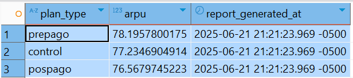

- [What is the revenue distribution by geographic location?](dbt/models/gold/revenue_by_location.sql)

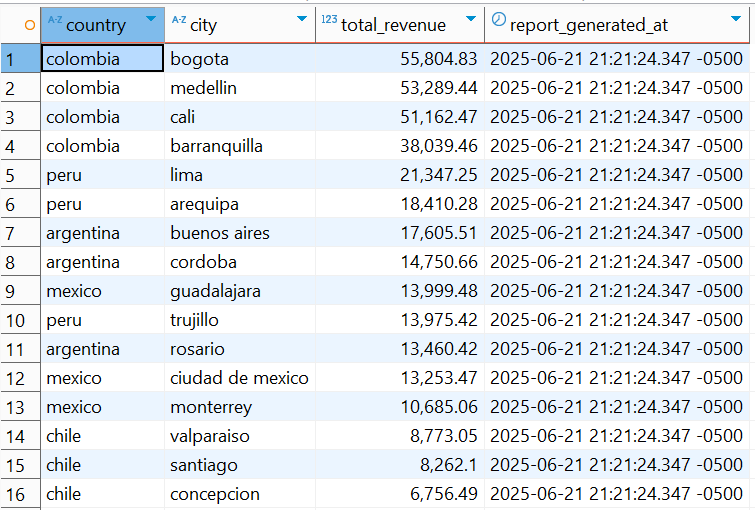

- [Which customer segments generate the highest revenue?](dbt/models/gold/revenue_by_age_segment.sql)

the segmentation was done by age

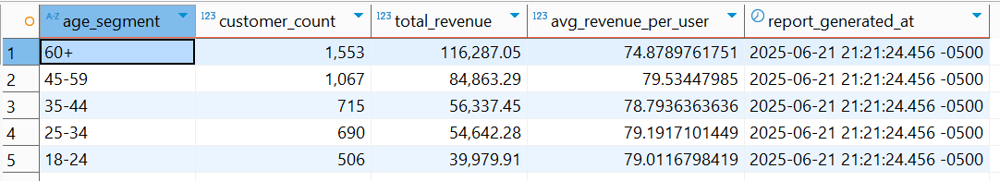

- [What is the distribution of customers by location?](dbt/models/gold/customer_distribution_by_location.sql)

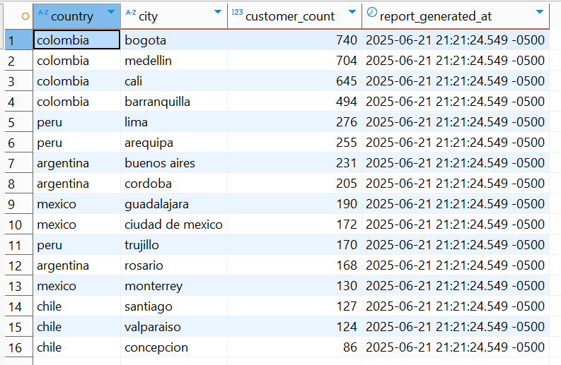

- [What is the age distribution of customers by plan type?](dbt/models/gold/age_distribution_by_plan.sql)

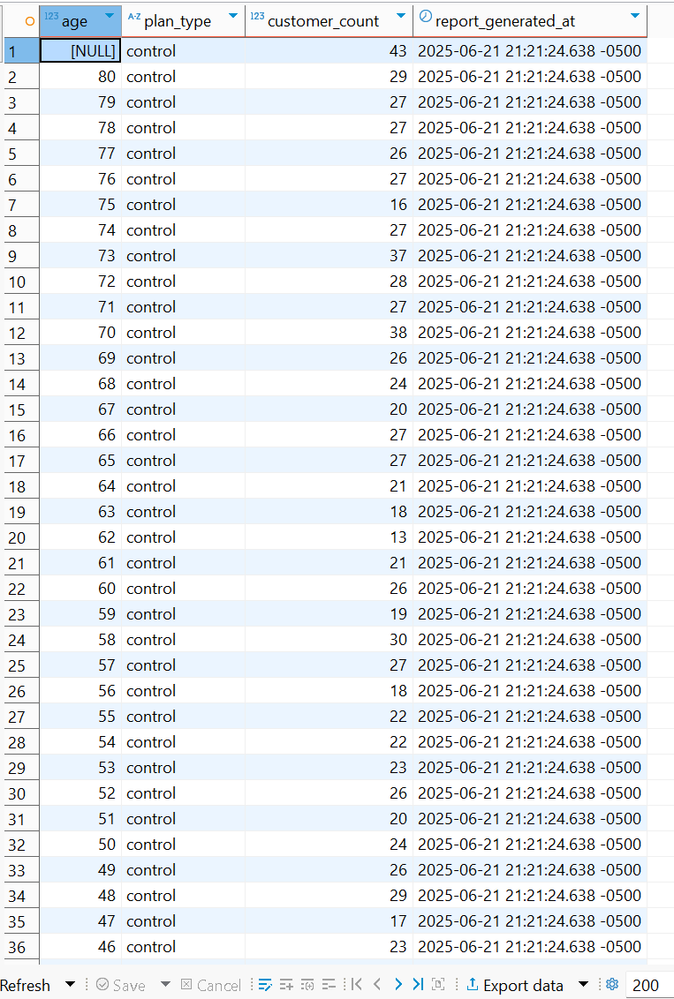

- [What is the age distribution by country and operator?](dbt/models/gold/age_distribution_by_country_operator.sql)

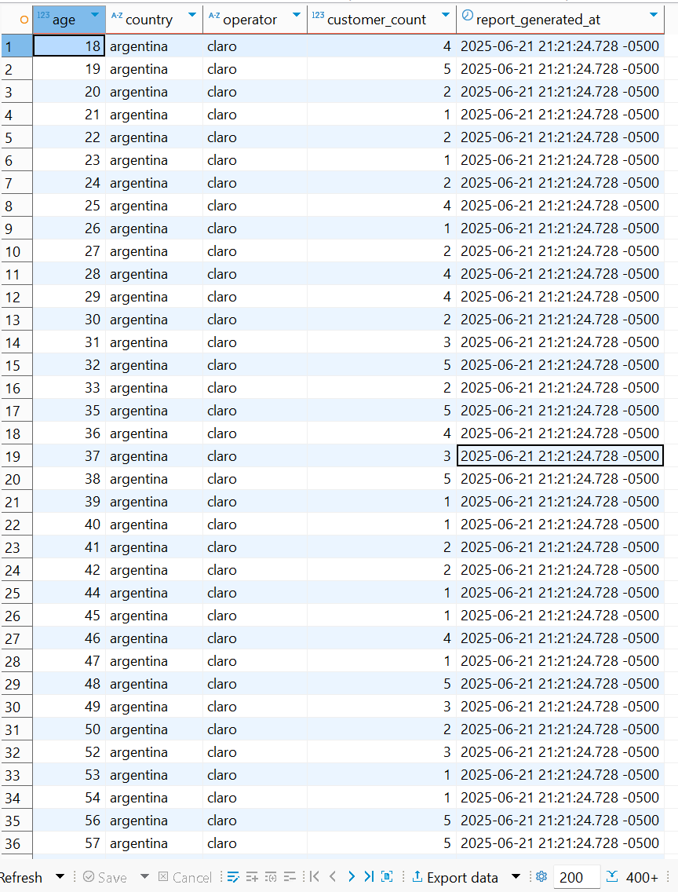

- [How are customers distributed across different operators?](dbt/models/gold/distribution_by_operator.sql)

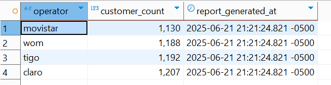


- [What is customer segmentation by credit score ranges?](dbt/models/gold/credit_score_segmentation.sql)

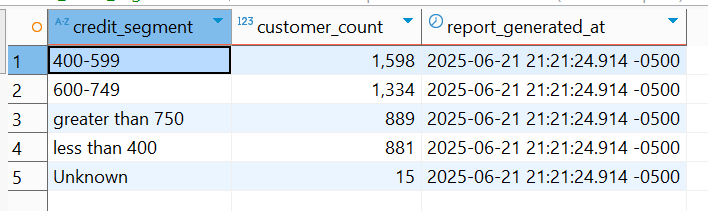

- [What are the most popular device brands?](dbt/models/gold/popular_device_brands.sql)

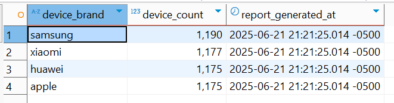


- [What is device brand preference by country/operator?](dbt/models/gold/device_brand_preference_by_country_operator.sql)

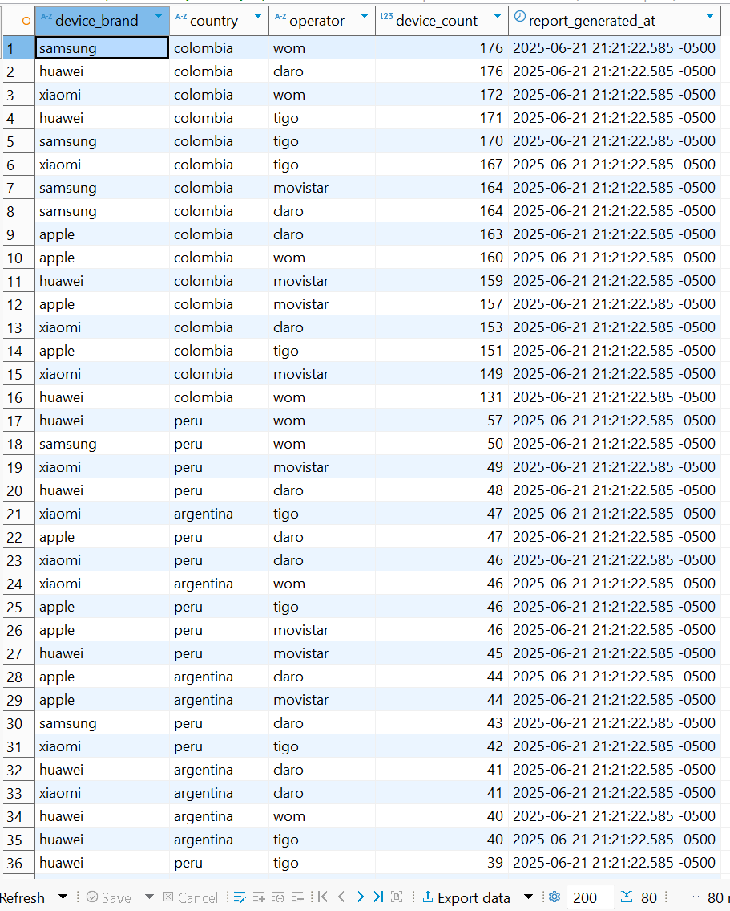

- [What is device brand preference by plan type?](dbt/models/gold/device_preference_by_plan_type.sql)

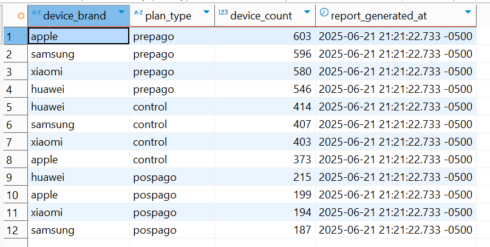

- [Which services are most commonly contracted?](dbt/models/gold/popular_services.sql)

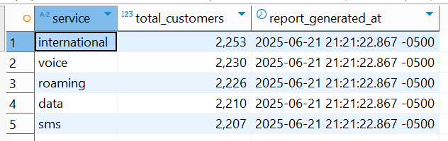

- [What service combinations are most popular?](dbt/models/gold/popular_service_combinations.sql)

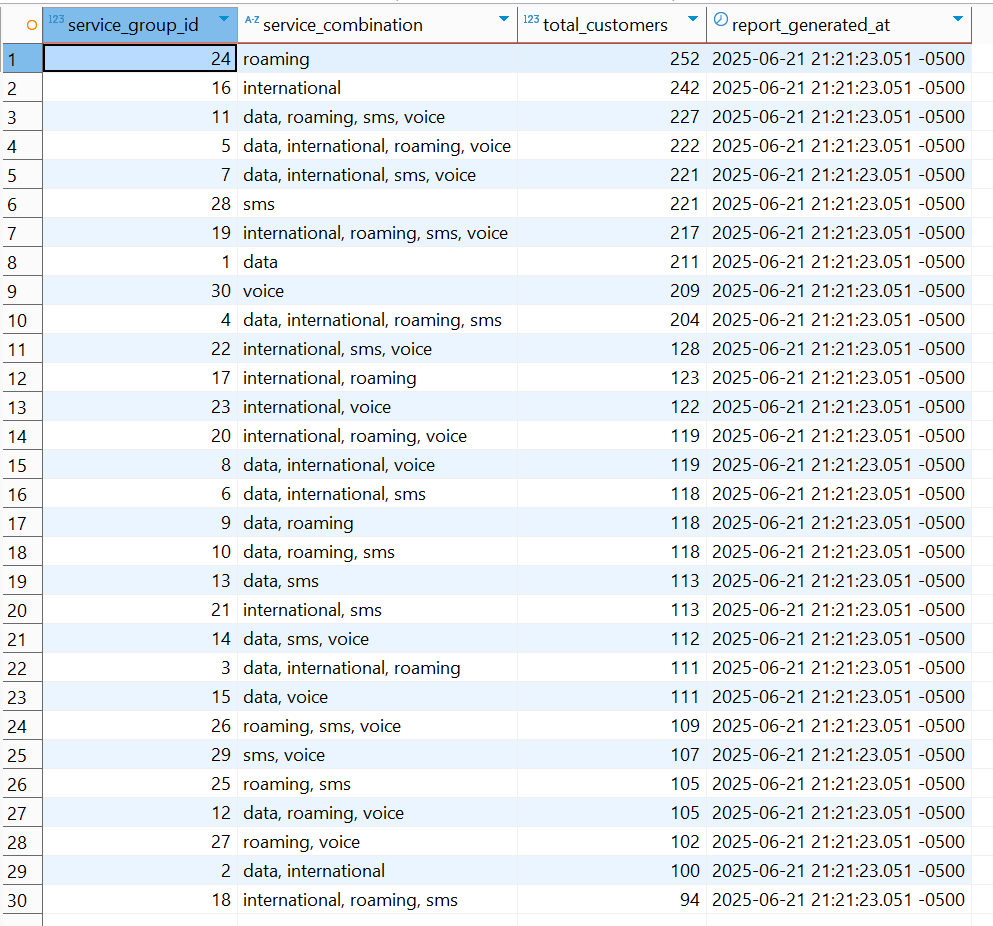

- [What percentage of customers have payment issues?](dbt/models/gold/payment_issues_percentage.sql)

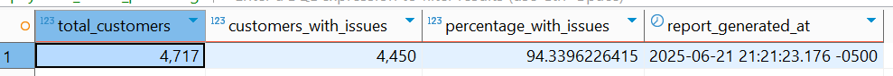

- [Which customers have pending payments?](dbt/models/gold/customers_with_pending_payments.sql)

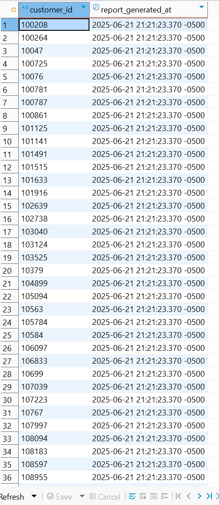

- [How does credit score correlate with payment behavior?](dbt/models/gold/credit_score_payments_corelation.sql)

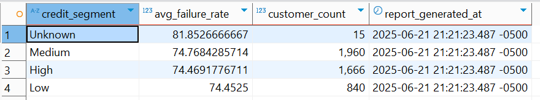

- [How does the distribution of new customers change over time?](dbt/models/gold/new_customers_over_time.sql)

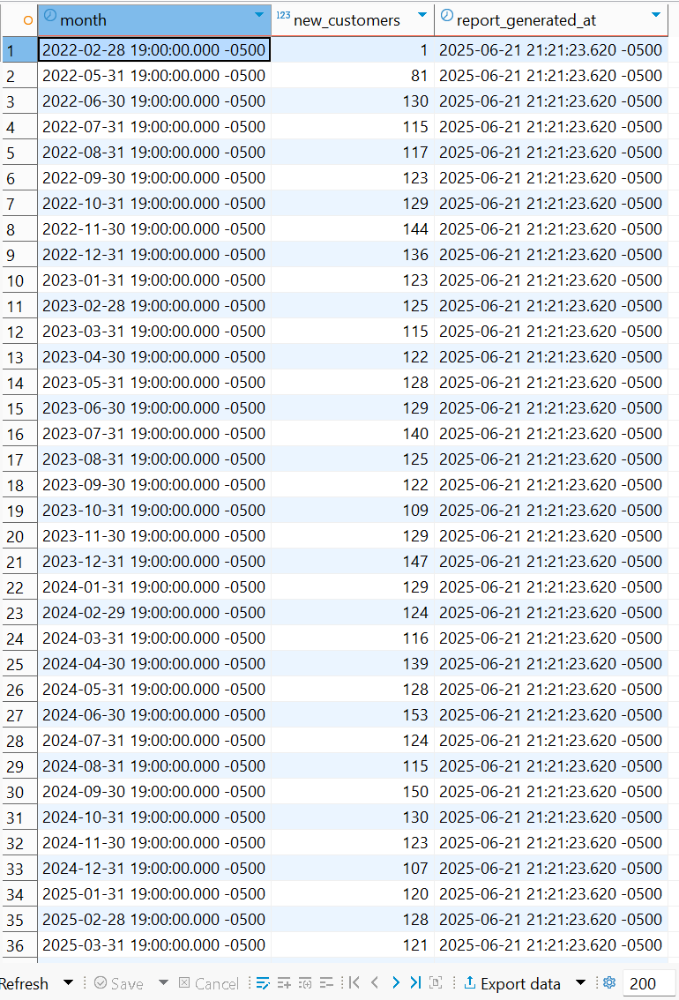

- [What are customer acquisition trends by operator?](dbt/models/gold/customer_acquisition_by_operator.sql)

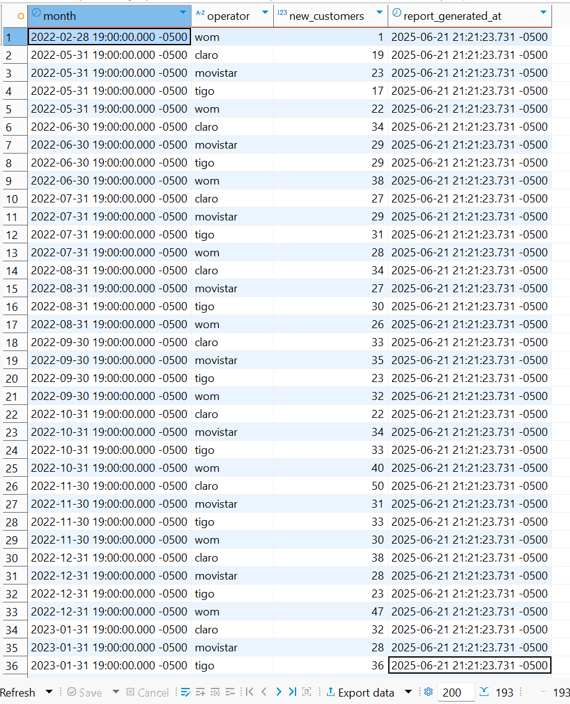

- [What percentage of customers are active/suspended/inactive?](dbt/models/gold/customer_status_distribution.sql)

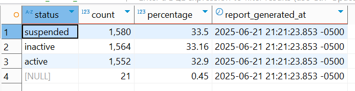

- [Which service combinations drive highest revenue?](dbt/models/gold/highest_revenue_by_service_combination.sql)

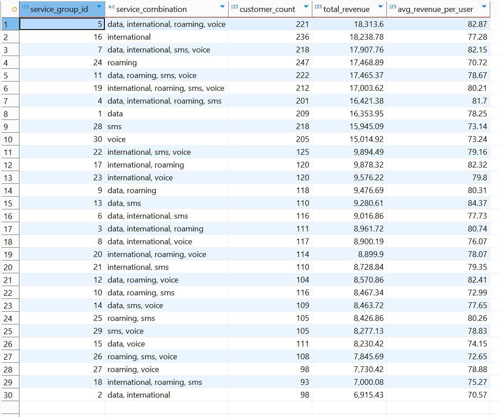

- [How do the mean and median monthly revenues per user compare across different plan types and operators?](dbt/models/gold/mean_median_revenue_comparison.sql)

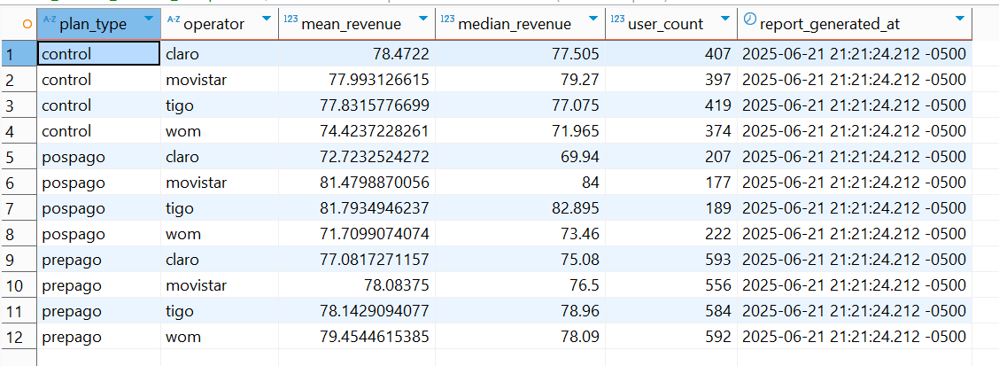

---


